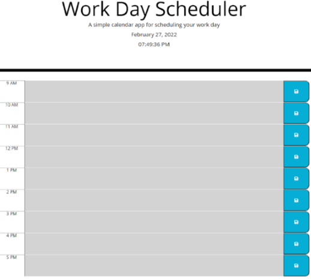
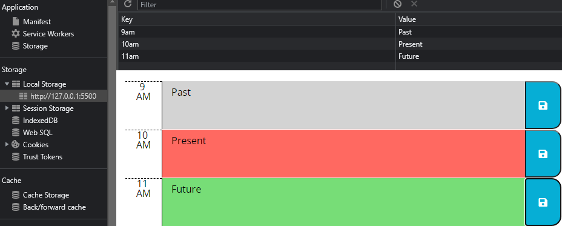

<h1><a href="https://jamehzlee.github.io/Day-Planner/">Day Planner</a></h1>

## The user can input text into each time slot and click the blue save button
## to store the data in their local storage

# Applied classes and text in local storage

## Depending on the current time, the time block background color will change.
## The text is stored only if the corresponding button is clicked.

